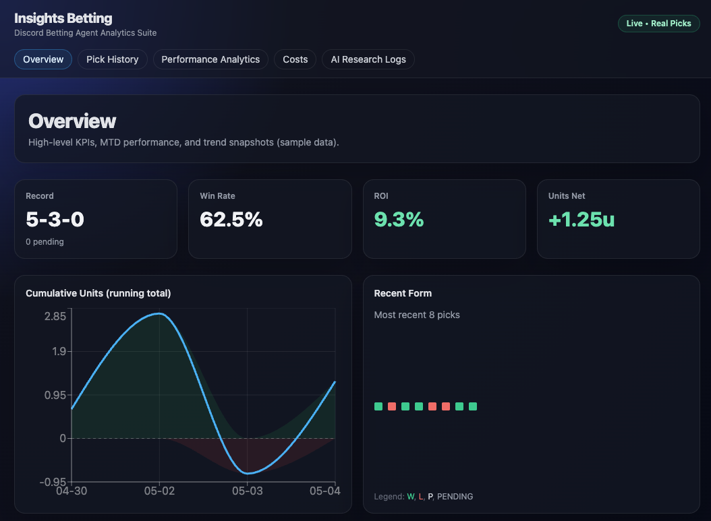
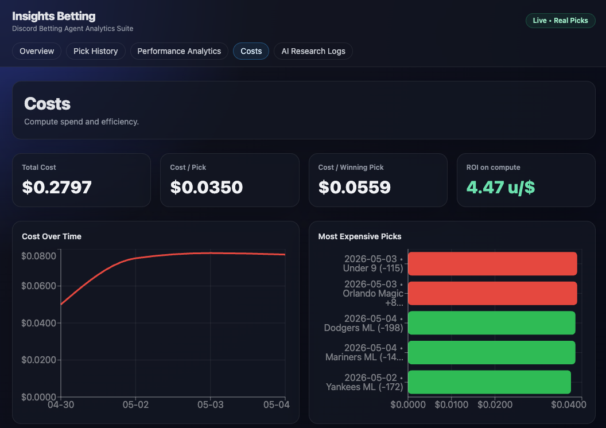
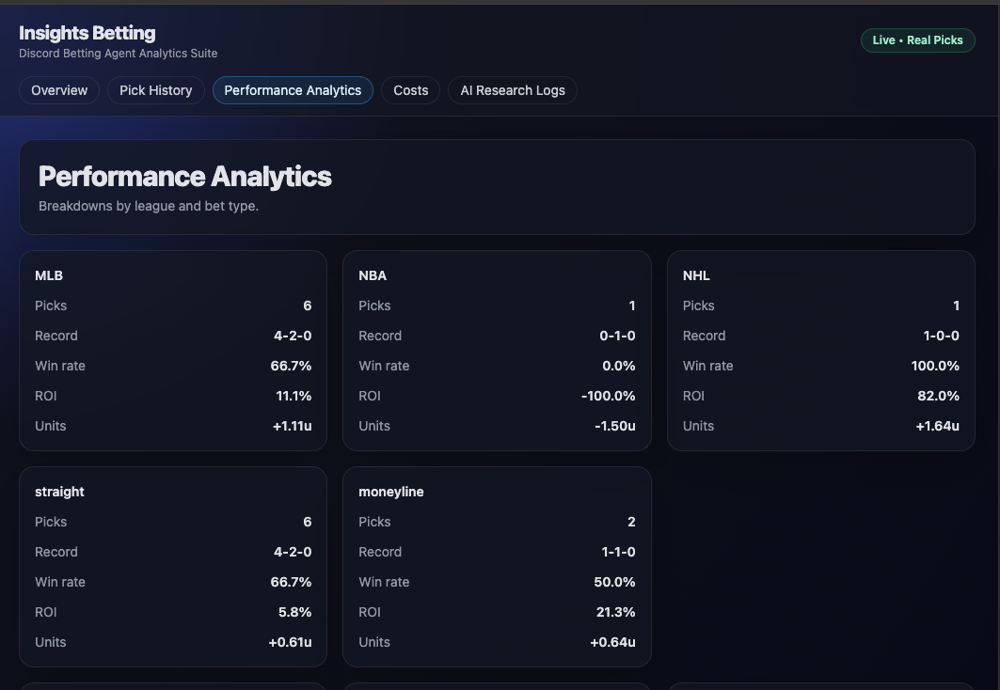

# Insights Betting

An AI-powered sports betting agent with a full analytics dashboard. Picks are generated daily by an autonomous agent, posted to Discord, synced to a database, and graded automatically. Every pick is tracked with full cost attribution down to the dollar.

**Live demo:** (https://insights-betting-dashboard.vercel.app/)

---

## What it does

Every day:
- **12:00 PM ET** — AI agent previews 2 plays for the day (best + secondary)
- **1:00 PM ET** — Picks posted to Discord channels with reasoning, confidence, units, and pass triggers
- **1:00–1:30 PM** — Picks sync to Supabase
- **3:00 AM ET** — Previous day's picks graded against ESPN final scores
- **24/7** — Dashboard reads live from the database, always up to date

The dashboard shows real performance: cumulative units, win rate by league/sport/bet type/confidence tier, cost per pick, and ROI on compute (units of profit per dollar spent on AI).

---

## Screenshots

### Overview — Real-time performance tracking


### Costs — AI compute cost attribution per pick


### Performance Analytics — Breakdowns by sport, bet type, confidence tier


---

## Architecture

```
┌─────────────────┐    ┌─────────────────┐    ┌─────────────────┐
│  AI Agent (Mac) │───▶│   Discord       │    │   Dashboard     │
│  - Generates    │    │   - Posts picks │    │   - Live charts │
│  - Researches   │    │                 │    │   - Cost views  │
│  - Grades       │    └─────────────────┘    └────────┬────────┘
└────────┬────────┘                                    │
         │                                             │
         ▼                                             │
┌─────────────────┐    ┌─────────────────┐            │
│   Supabase      │◀───│  Sync Pipeline  │            │
│   - picks       │    │  (launchd)      │            │
│   - generation  │    │  - sync queue   │◀───────────┘
│     _runs       │    │  - cost attr.   │
│   - pick_costs  │    │  - enrichment   │
└─────────────────┘    └─────────────────┘
```

**Key design:** AI-judgment jobs run via OpenClaw cron; deterministic ETL jobs run via macOS launchd to avoid paying for LLM tokens on simple data movement. This split cut daily API spend from ~$1.71 to ~$0.30.

---

## Tech stack

- **Frontend:** React, TypeScript, Vite, Tailwind, Recharts
- **Backend:** Node.js
- **Database:** Supabase (Postgres) with Row Level Security
- **AI:** OpenAI GPT-5.2 via OpenClaw agent runtime
- **Scheduling:** OpenClaw cron (LLM jobs) + macOS launchd (script jobs)
- **Score data:** ESPN public API

---

## Cost tracking

Every pick is attributed to its source AI run with full token-level cost data:

| Field | Example |
|---|---|
| Tokens consumed | 21,452 input / 890 output |
| Cost per pick | $0.025 – $0.039 |
| Pricing version | `openai_2026-05-01` |
| Linked to run | via `generation_runs.session_key` |

**ROI on compute** is a real metric: profit per dollar of AI spend. As of writing, the agent runs at +4.47 units per dollar.

---

## Local development

```bash
# Backend
cd server
npm install
cp .env.example .env  # add your Supabase keys
node server.js

# Frontend (separate terminal)
cd web
npm install
npm run dev
```

---

## Notable engineering decisions

- **Two-stage cost attribution.** Producer stamps run identifiers; cost sync attributes tokens later (decouples enrichment from LLM run completion, handles slow OpenClaw log flushes).
- **Tolerance window matching.** Run logs use millisecond timestamps that don't perfectly align; cost sync matches within a 60-second window.
- **Idempotent everywhere.** Every sync uses `ON CONFLICT DO NOTHING` or upsert semantics — safe to retry, no duplicates.
- **Skill mode for AI prompts.** The 12pm preview prompt enforces hard caps on tool calls (max 8) and prefers `web_fetch` over browser to keep cost predictable. This single change cut preview cost by 79%.
- **Defensive grading.** Score fetcher matches teams via case-insensitive substring both ways; grading handles moneyline / spread / totals using structured columns instead of fragile string matching.

---

## Incidents fixed during build

A real incident log, because production systems break and how you handle it matters:

- **Schema drift bug.** Picks table required `game NOT NULL` but producer wasn't sending it. Fixed at two layers (defensive sync-side fallback + producer-side fix).
- **Date-stamp bug.** Enrichment script computed "today's 1pm ET" instead of "1pm ET on the pick's actual date." Mis-attributed Sunday picks to Tuesday's run. Fixed to derive from `pick_date`.
- **Score scraper returning dates.** DDG-via-r.jina.ai HTML scrape's regex was matching MM-DD strings on the page (e.g., game date "5/4") and returning them as scores. Replaced with ESPN public API.
- **Broken upsert.** Used a partial unique index for `ON CONFLICT` resolution; PostgREST can't use partial indexes for upsert. Converted to a regular unique constraint.
- **15× cost regression.** Sync crons were running as `agentTurn` (LLM) jobs to invoke deterministic scripts. Migrated them to launchd, dropped daily cost from ~$1.71 to ~$0.30.

---

## What's not included

- The OpenClaw agent prompts and cron config (these live on my Mac, separate from the dashboard repo)

---

Built by Jaden.
